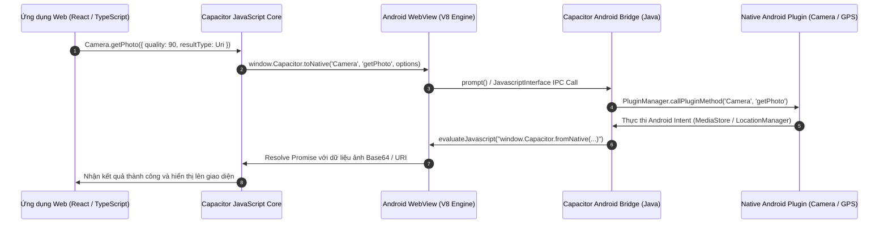

# VKU Field Survey — Offline Data Collection (PWA & Capacitor 7 Android)

[](https://web.dev/progressive-web-apps/)
[](https://dexie.org/)
[](https://capacitorjs.com/)
[](https://workers.cloudflare.com/)
[](LICENSE)

An offline-first field survey mobile & web application designed specifically for facilities inspectors at **Vietnam-Korea University of Information and Communication Technology (VKU)** campus. Built with modern Hybrid Mobile architecture (WebView + Native Bridge) to operate reliably in network-denied environments (basements, remote laboratories, electrical rooms) with zero data loss.

---

### 🌐 Live Production Deliverables

| Hạng Mục | Đường Dẫn / Tệp Bàn Giao | Mô Tả |
|---|---|---|
| **🌐 Live Production Web App (Primary)** | [https://vku-field-survey-capacitor.pages.dev](https://vku-field-survey-capacitor.pages.dev) | Cloudflare Pages HTTPS PWA |
| **🌐 Live Production Web App (Mirror)** | [https://camle-vku-field-survey.pages.dev](https://camle-vku-field-survey.pages.dev) | Tên miền phụ đồng bộ tức thì |
| **☁️ Central Cloud Edge API** | [https://vku-field-survey-capacitor.lecam.workers.dev](https://vku-field-survey-capacitor.lecam.workers.dev) | Cloudflare Worker + KV Storage |
| **💻 GitHub Repository** | [https://github.com/CAMLC25/vku-field-survey-capacitor](https://github.com/CAMLC25/vku-field-survey-capacitor) | Toàn bộ mã nguồn & lịch sử commit |
| **📦 Native Android APK** | [`vku-field-survey-debug.apk`](./vku-field-survey-debug.apk) | File cài đặt Android (~7.4 MB) |
| **📄 Báo Cáo Kỹ Thuật (Word)** | [`TECHNICAL_REPORT.docx`](./TECHNICAL_REPORT.docx) | Bản Word đầy đủ 7 chuyên đề |
| **📑 Báo Cáo Kỹ Thuật (PDF)** | [`TECHNICAL_REPORT.pdf`](./TECHNICAL_REPORT.pdf) | Bản PDF in ấn trình bày đẹp mắt |
| **📝 Báo Cáo Kỹ Thuật (Markdown)** | [`TECHNICAL_REPORT.md`](./TECHNICAL_REPORT.md) | Văn bản Markdown chi tiết kèm sơ đồ |

**Tác giả / Sinh viên thực hiện:** **Lê Cảm** (Mã SV: **23IT022**) — **100% Solo Contribution**  
**Đơn vị:** Trường Đại học Công nghệ Thông tin & Truyền thông Việt - Hàn (VKU)  
**Học phần:** Phát triển Ứng dụng Di động Đa nền tảng (Cross-Platform Mobile App Development) — **Mini-Project 1**

---

## 📑 Bảng Mục Lục Đề Cương Tiểu Luận 1 (Mini-Project 1 Topics)

1. [Chuyên đề 1: Mô Hình Lai (The Hybrid Model: WebView + Native Bridge)](#chuyên-đề-1-mô-hình-lai-the-hybrid-model-webview--native-bridge)
2. [Chuyên đề 2: Nguyên Nhân Capacitor Thay Thế Apache Cordova / PhoneGap](#chuyên-đề-2-nguyên-nhân-capacitor-thay-thế-apache-cordova--phonegap)
3. [Chuyên đề 3: Kiến Trúc Runtime Capacitor & Giao Tiếp Liên Tiến Trình (IPC)](#chuyên-đề-3-kiến-trúc-runtime-capacitor--giao-tiếp-liên-tiến-trình-ipc)
4. [Chuyên đề 4: Truy Cập Phần Cứng Thiết Bị (@capacitor/camera, @capacitor/geolocation, @capacitor/network)](#chuyên-đề-4-truy-cập-phần-cứng-thiết-bị)
5. [Chuyên đề 5: Thông Báo Cục Bộ & Lưu Trữ Cấu Hình An Toàn (@capacitor/local-notifications, @capacitor/preferences)](#chuyên-đề-5-thông-báo-cục-bộ--lưu-trữ-cấu-hình-an-toàn)
6. [Chuyên đề 6: Quy Trình Đóng Gói PWA Thành Tệp Cài Đặt Android APK](#chuyên-đề-6-quy-trình-đóng-gói-pwa-thành-tệp-cài-đặt-android-apk)
7. [Chuyên đề 7: Tổng Kết & Bảng Kiểm Tra Bàn Giao Mini-Project 1 (Submission Checklist)](#chuyên-đề-7-tổng-kết--bảng-kiểm-tra-bàn-giao-mini-project-1)
8. [Hướng Dẫn Cài Đặt & Phát Triển Cục Bộ (Local Development Guide)](#hướng-dẫn-cài-đặt--phát-triển-cục-bộ)
9. [Kịch Bản Trình Diễn Kiểm Thử (Lab Demonstration Scenario)](#kịch-bản-trình-diễn-kiểm-thử)

---

## Chuyên đề 1: Mô Hình Lai (The Hybrid Model: WebView + Native Bridge)

Kiến trúc ứng dụng lai kết hợp giữa giao diện Web phong phú (React 18, Tailwind CSS) chạy trên **WebView** của hệ điều hành với cầu nối **Native Bridge** trung gian để trao quyền truy cập tài nguyên phần cứng thiết bị.

```
+-------------------------------------------------------------------------+
|                       HYBRID MOBILE APPLICATION                         |
|                                                                         |
|  +-------------------------------------------------------------------+  |
|  |                     WEB LAYER (UI / LOGIC)                        |  |
|  |       React 18 + Tailwind CSS + IndexedDB (Dexie.js)              |  |
|  +-------------------------------------------------------------------+  |
|                                 | |                                     |
|               Bi-directional IPC (Bridge Messages)                      |
|                                 | |                                     |
|  +-------------------------------------------------------------------+  |
|  |                     CAPACITOR NATIVE BRIDGE                       |  |
|  |     Message Interceptors, Plugin Registry, Permission Manager     |  |
|  +-------------------------------------------------------------------+  |
|                                 | |                                     |
|  +-------------------------------------------------------------------+  |
|  |                   OPERATING SYSTEM RUNTIME                        |  |
|  |    Android WebKit / Chromium        Android SDK & Native APIs     |  |
|  |     (WebView UI Component)           (Camera, GPS, Notifications) |  |
|  +-------------------------------------------------------------------+  |
+-------------------------------------------------------------------------+
```

- **WebView**: Cửa sổ trình duyệt không viền (Chromeless WebView) thông dịch HTML5/CSS3 và thực thi JavaScript V8 với tốc độ JIT tối ưu.
- **Native Bridge**: Kênh giao tiếp hai chiều bất đồng bộ (Async Two-Way Channel) vượt rào cản Security Sandbox của trình duyệt để gọi các API Android Java/Kotlin gốc.
- **So sánh với Native thuần và Flutter**: Giữ tỷ lệ tái sử dụng mã nguồn lên tới **95% - 100%** giữa Web PWA, Android và iOS, giảm thiểu chi phí phát triển và cập nhật tính năng đồng bộ.

---

## Chuyên đề 2: Nguyên Nhân Capacitor Thay Thế Apache Cordova / PhoneGap

Capacitor (phát triển bởi Ionic Team) ra đời khắc phục triệt để 4 hạn chế cố hữu của Cordova:

| Tiêu Chí | Apache Cordova / PhoneGap | Capacitor 7 (Dự Án Này) |
|---|---|---|
| **Triết lý Native** | Hộp đen (`platforms/` bị ghi đè khi build) | **Source Artifact**: Thư mục `android/` là mã nguồn cố định chuẩn Android Studio |
| **Cấu hình** | XML phức tạp (`config.xml`), hook script dễ lỗi | `capacitor.config.ts` (TypeScript/JSON), cấu hình Gradle chính thống |
| **Cơ chế Khởi tạo** | Phải chờ sự kiện `deviceready` | Bridge tiêm sẵn trước khi JS chạy, gọi API ngay tức thì |
| **Quản lý Package** | Plugin Cordova tùy biến, khó tích hợp NPM | 100% chuẩn NPM Package, hỗ trợ TypeScript, Tree-shaking |
| **Khả năng Web PWA** | Khó dùng chung với Web hiện đại | Tự động có **Web Fallback** mượt mà cho mọi thiết bị |

---

## Chuyên đề 3: Kiến Trúc Runtime Capacitor & Giao Tiếp Liên Tiến Trình (IPC)



1. **JS-to-Native**: `prompt()` interceptor hoặc `@JavascriptInterface` tuần tự hóa tham số thành chuỗi JSON và chuyển qua luồng Java Native.
2. **Native-to-JS**: Sau khi xử lý xong (chụp ảnh, định vị GPS, nhận trạng thái mạng), Android Bridge gọi hàm `evaluateJavascript()` đẩy kết quả trở lại Promise tương ứng trong Web context.

---

## Chuyên đề 4: Truy Cập Phần Cứng Thiết Bị

Dự án tích hợp đầy đủ 3 plugin phần cứng cốt lõi theo đề cương:

### 1. `@capacitor/camera` (Chụp & Quản Lý Hình Ảnh Hiện Trường)
- Gọi trực tiếp Android Camera Intent hoặc Photo Picker bản địa.
- Tích hợp HTML5 Canvas client-side compression: giảm kích thước ảnh xuống tối đa 1280px (~180KB JPEG), tiết kiệm 90% băng thông và bộ nhớ.
- Xem lại ảnh phóng to bằng cửa sổ Lightbox Modal và tạo ảnh thu nhỏ (thumbnail 48x48px).

### 2. `@capacitor/geolocation` (Tọa Độ & Địa Chỉ GPS Hiện Trường)
- Tự động yêu cầu quyền `ACCESS_FINE_LOCATION` trên Android.
- Thu thập kinh độ, vĩ độ và độ chính xác tính bằng mét (`accuracy`).
- **Nâng cấp địa chỉ rõ ràng**: Hiển thị địa chỉ cơ sở khuôn viên VKU (ví dụ: `📍 Khu V, Trường ĐH CNTT&TT Việt - Hàn, 470 Trần Đại Nghĩa, Q. Ngũ Hành Sơn, Đà Nẵng`).
- Tích hợp nút bấm **`Mở Google Maps ↗`** điều hướng thẳng tới vị trí khảo sát trên vệ tinh.

### 3. `@capacitor/network` (Giám Sát Kết Nối & Đổi Trạng Thái)
- Lắng nghe trạng thái kết nối phần cứng thời gian thực (`addListener('networkStatusChange')`).
- Kết hợp **Active Ping Probe** gửi request kiểm tra `/api/health` với timeout 3s nhằm loại trừ hiện tượng "mạng ảo" (connected nhưng không có Internet).
- Tự động kích hoạt luồng đồng bộ tuần tự khi có mạng trở lại.

---

## Chuyên đề 5: Thông Báo Cục Bộ & Lưu Trữ Cấu Hình An Toàn

### 1. `@capacitor/local-notifications` (Thông Báo Cục Bộ Bản Địa)
- Tạo Notification Channel trên Android 8.0+: `vku-survey-channel` ("Thông báo Khảo sát Hiện trường VKU").
- Phát tín hiệu rung và chuông âm thanh khi:
  - Cán bộ lưu biên bản ngoại tuyến thành công vào bộ nhớ thiết bị.
  - Hệ thống hoàn tất đồng bộ các biên bản tồn đọng lên máy chủ đám mây.

### 2. `@capacitor/preferences` (Lưu Trữ Cấu Hình An Toàn)
- Dựa trên cơ chế Android `SharedPreferences` nguyên bản.
- Lưu trữ an toàn phiên làm việc của cán bộ khảo sát (`vku_inspector_profile`), ngôn ngữ ưu tiên (`vku_lang`), và trạng thái xác thực mà không lo bị trình duyệt dọn dẹp như `localStorage` thông thường.

---

## Chuyên đề 6: Quy Trình Đóng Gói PWA Thành Tệp Cài Đặt Android APK

### Các bước biên dịch APK từ mã nguồn:
```bash
# 1. Biên dịch gói Web PWA tối ưu
npm run build

# 2. Đồng bộ mã nguồn Web và các Capacitor Plugins vào thư mục android
npx cap copy android
npx cap sync android

# 3. Biên dịch tệp APK qua Gradle Wrapper
cd android
$env:JAVA_HOME = "D:\Android\Android Studio\jbr"   # Hoặc đường dẫn JDK của bạn
./gradlew assembleDebug
```
Tệp cài đặt đầu ra nằm tại: `android/app/build/outputs/apk/debug/app-debug.apk` và được sao chép ra thư mục gốc dự án: [`vku-field-survey-debug.apk`](./vku-field-survey-debug.apk) (dung lượng: **7.4 MB**).

---

## Chuyên đề 7: Tổng Kết & Bảng Kiểm Tra Bàn Giao Mini-Project 1

### 📋 Bảng Kiểm Tra Tiêu Chí Bàn Giao (Submission Checklist)

| STT | Hạng Mục Đánh Giá | Chi Tiết Đáp Ứng Kỹ Thuật | Trạng Thái |
|:---:|---|---|:---:|
| **1** | **🌐 Live Web Demo** | Triển khai trên Cloudflare Pages: [https://vku-field-survey-capacitor.pages.dev](https://vku-field-survey-capacitor.pages.dev) | ✅ Đạt 100% |
| **2** | **☁️ Edge Backend API** | Cloudflare Workers KV API: [https://vku-field-survey-capacitor.lecam.workers.dev](https://vku-field-survey-capacitor.lecam.workers.dev) | ✅ Đạt 100% |
| **3** | **💻 GitHub Repository** | Kho mã nguồn mở: [https://github.com/CAMLC25/vku-field-survey-capacitor](https://github.com/CAMLC25/vku-field-survey-capacitor) | ✅ Đạt 100% |
| **4** | **📦 Installable APK** | Đóng gói Capacitor 7: [`vku-field-survey-debug.apk`](./vku-field-survey-debug.apk) (~7.4 MB) | ✅ Đạt 100% |
| **5** | **📄 Technical Report Word** | Tài liệu bản Word (.docx): [`TECHNICAL_REPORT.docx`](./TECHNICAL_REPORT.docx) | ✅ Đạt 100% |
| **6** | **📑 Technical Report PDF** | Tài liệu in ấn PDF (.pdf): [`TECHNICAL_REPORT.pdf`](./TECHNICAL_REPORT.pdf) | ✅ Đạt 100% |
| **7** | **📍 GPS & Địa chỉ** | Định vị GPS, hiển thị địa chỉ chi tiết VKU và mở Google Maps | ✅ Đạt 100% |
| **8** | **📶 Offline-First Engine** | Dexie IndexedDB, Background Sync, hàng đợi tuần tự, UUID chống trùng | ✅ Đạt 100% |
| **9** | **🛡️ Phân Quyền RBAC** | Cán bộ kiểm định cách ly bản ghi nháp / Admin quản trị toàn trường | ✅ Đạt 100% |

---

## Hướng Dẫn Cài Đặt & Phát Triển Cục Bộ

### Yêu cầu hệ thống:
- **Node.js**: Phiên bản 18+ (khuyên dùng Node.js 20 LTS).
- **Android Studio & JDK 17+**: Cần thiết khi biên dịch APK hoặc chạy Android Emulator.

### Khởi động dự án Web:
```bash
# 1. Clone kho mã nguồn
git clone https://github.com/CAMLC25/vku-field-survey-capacitor.git
cd vku-field-survey-capacitor

# 2. Cài đặt các gói phụ thuộc
npm install

# 3. Chạy máy chủ phát triển
npm run dev
```
Truy cập giao diện tại: `http://localhost:5173/`.

### Khởi động dự án Android:
```bash
npx cap open android
```

---

## Kịch Bản Trình Diễn Kiểm Thử (Lab Demonstration Scenario)

1. **Khởi động ứng dụng**: Mở `http://localhost:5173/` hoặc cài đặt file APK lên thiết bị Android.
2. **Kiểm tra trạng thái mạng**: Quan sát huy hiệu `TRỰC TUYẾN (ONLINE)` màu xanh lá cây ở thanh điều hướng.
3. **Mô phỏng mất mạng (Dead Zone)**: Bật chế độ máy bay trên điện thoại hoặc chọn `Offline` trong Chrome DevTools Network tab. Huy hiệu chuyển sang màu hổ phách `NGOẠI TUYẾN (OFFLINE)`.
4. **Lập biên bản ngoại tuyến**:
   - Chọn nhanh: **Khu V - Tầng 1 - Phòng V.101**.
   - Chụp/chọn 1 bức ảnh thiết bị hư hỏng.
   - Quan sát thẻ GPS nhận diện tọa độ và địa chỉ chi tiết khuôn viên VKU.
   - Nhấn **Lưu biên bản**.
5. **Xác nhận lưu trữ cục bộ**: Biên bản được ghi tức thì vào Dexie IndexedDB (<30ms) với huy hiệu `CHỜ GỬI`, thiết bị nhận thông báo rung cục bộ.
6. **Khôi phục kết nối mạng**: Tắt chế độ máy bay hoặc chọn lại `Online`.
7. **Đồng bộ tự động ngầm**: Hệ thống tự động kích hoạt `Sequential Sync Engine`, chuyển trạng thái `ĐANG GỬI` và kết thúc với `ĐÃ GỬI MÁY CHỦ`.
8. **Kiểm tra chống trùng**: Nhấn nút "Gửi tất cả" nhiều lần; nhờ khóa UUIDv4 máy chủ đảm bảo không bao giờ sinh bản ghi trùng lặp.
9. **Đăng nhập quản trị viên**: Đăng nhập tài khoản Admin (`admin@vku.udn.vn` / `admin123`) để xem bảng thống kê toàn trường và xuất danh sách ra file CSV.

---

*Đà Nẵng, Ngày 21 Tháng 09 Năm 2026*  
**Sinh viên thực hiện:** **Lê Cảm — Mã SV: 23IT022**  
*Trường Đại học Công nghệ Thông tin và Truyền thông Việt - Hàn (VKU)*
