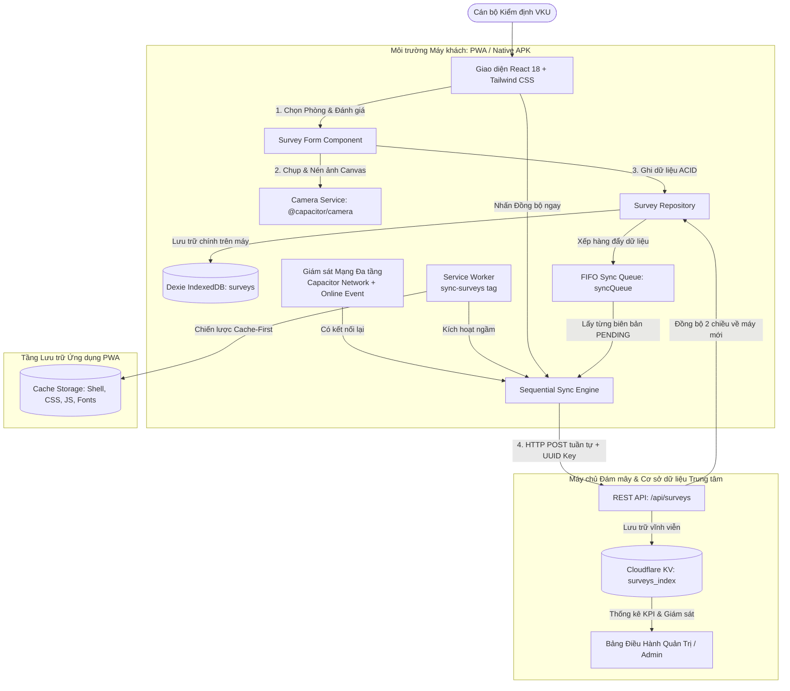

# VKU Field Survey — Offline Data Collection (PWA & Capacitor Android)

[](https://web.dev/progressive-web-apps/)
[](https://dexie.org/)
[](https://capacitorjs.com/)
[](https://workers.cloudflare.com/)
[](LICENSE)

An offline-first field survey mobile & web application designed specifically for facilities inspectors at **Vietnam-Korea University of Information and Communication Technology (VKU)** campus. Built to operate reliably in network-denied environments (basements, remote laboratories, electrical rooms) with zero data loss.

---

### 🌐 Live Production Deliverables
- **Live Production PWA (Cloudflare Pages HTTPS):** [https://camle-vku-field-survey.pages.dev](https://camle-vku-field-survey.pages.dev)
- **Central Cloud Edge API (Cloudflare Worker & KV):** [https://camle-vku-field-survey.lecam.workers.dev](https://camle-vku-field-survey.lecam.workers.dev)
- **GitHub Repository (Public Source Code):** [https://github.com/CAMLC25/vku-field-survey-capacitor](https://github.com/CAMLC25/vku-field-survey-capacitor)
- **Pre-built Native Android APK:** [`vku-field-survey-debug.apk`](./vku-field-survey-debug.apk) *(6.7 MB — compiled with Gradle & Android Studio)*
- **Technical Report (PDF):** [`TECHNICAL_REPORT.pdf`](./TECHNICAL_REPORT.pdf) *(Comprehensive Vietnamese technical report)*
- **Lead Developer / Author:** **Lê Cảm** (Mã SV: **23IT022**) — **100% Solo Contribution**

---

## Table of Contents
1. [Executive Summary](#1-executive-summary)
2. [Key Features & Capabilities](#2-key-features--capabilities)
3. [Architecture Overview](#3-architecture-overview)
4. [Technology Stack](#4-technology-stack)
5. [Repository Structure](#5-project-structure)
6. [Data Isolation & Security Model (RBAC)](#6-data-isolation--security-model-rbac)
7. [Synchronization & Offline Resilience](#7-synchronization--offline-resilience)
8. [Local Development Guide](#8-local-development-guide)
9. [PWA Offline Testing Guide](#9-pwa-offline-testing-guide)
10. [Capacitor Android Native Setup & Build](#10-capacitor-android-native-setup--build)
11. [Cloudflare Edge & REST API Specification](#11-cloudflare-edge--rest-api-specification)
12. [Lab Demonstration Scenario](#12-lab-demonstration-scenario)

---

## 1. Executive Summary
Facilities inspectors at VKU routinely encounter areas with zero cellular (4G/5G) or Wi-Fi coverage. Traditional web applications break down in these conditions, resulting in dropped requests, lost reports, and unrecorded campus equipment damages.

**VKU Field Survey** addresses this with a strict **Offline-First Architecture**:
- **IndexedDB is the primary source of truth** for all records created on the device.
- All inspection records are tagged with a client-generated **UUIDv4**, timestamps, and lifecycle synchronization status.
- Defect photos are compressed client-side via HTML5 Canvas and stored locally as binary **Blobs** or Data URLs.
- The app shell is cached via a **Cache-First Workbox Service Worker**, enabling 100% offline boot.
- When internet returns, surveys are uploaded **sequentially** to eliminate network saturation, backed by **Background Sync**, **active network probing**, and **two-way cloud synchronization**.

---

## 2. Key Features & Capabilities

- **Core Capacitor Native Hardware Integration**:
  - 📷 **`@capacitor/camera`**: Native camera shutter & photo gallery picker with auto-compression (JPEG 1280px ~180KB).
  - 📍 **`@capacitor/geolocation`**: Precise GPS coordinates recording (lat, lng, accuracy in meters) with 1-tap Google Maps view.
  - 📶 **`@capacitor/network`**: Hardware-level connection listener paired with Active Ping probe.
  - 🔔 **`@capacitor/local-notifications`**: Native Android notification channel (`vku-survey-channel`) alerting when surveys are stored offline or synced.
  - 🔐 **`@capacitor/preferences`**: Persistent key-value storage utilizing Android `SharedPreferences` for inspector identity and language settings.
- **100% Offline Boot (Service Worker Cache-First)**: HTML, CSS, JavaScript chunks, fonts, and assets are precached.
- **Client-Side Persistence (Dexie.js IndexedDB)**: ACID transactions across `surveys` and `syncQueue` tables.
- **1-Tap Fast Location Picker**: Quick selection of 4 VKU campus zones (`Khu V`, `Khu K`, `Khu A`, `Khu B`), 5 floors, and 10 dynamic room presets per floor.
- **Sequential Sync Engine**: Uploads surveys one-by-one (`for...of`) with a 300ms delay to prevent mobile socket exhaustion.
- **Idempotent Dispatch**: Uses client-generated UUIDv4 as the primary key on the server, guaranteeing zero duplicates during retries.
- **Photo Thumbnails & Modal Viewer**: Every survey record displays an interactive thumbnail supporting both local binary Blobs and remote Cloudflare KV URLs with a full-screen image inspection modal.
- **User Data Isolation & RBAC**:
  - **Inspectors**: Only view, edit, and delete their own draft surveys (`createdByEmail`).
  - **Admins**: Access the Admin Command Center with campus-wide statistics, filters, user management, and UTF-8 CSV exports.
- **Cross-Device Bi-Directional Sync**: Automatically pulls cloud surveys down to new devices upon login via `pullSurveysFromCloud()`.
- **iOS Safari / WebKit Resilience**: Solves Safari background sync limits using non-blocking IndexedDB writes, active network probe, and `visibilitychange` lifecycle handlers.
- **Bilingual Interface**: Seamless 1-tap switching between **Tiếng Việt** and **English**.

---

## 3. Architecture Overview



---

## 4. Technology Stack

### Frontend & PWA
- **Core Framework**: React 18 with TypeScript & Vite 6
- **Styling**: Tailwind CSS (VKU Brand Palette `#0284c7`, safe-area insets)
- **Local Database**: Dexie.js v4 & `dexie-react-hooks` (IndexedDB ODM)
- **Offline & Service Worker**: `vite-plugin-pwa` + Google Workbox (Cache-First strategy)
- **Icons**: Lucide React

### Native Mobile Platform
- **Capacitor 7 Core & CLI**
- **@capacitor/android**: Android native runtime bridge
- **@capacitor/camera**: Native camera and photo picker integration
- **@capacitor/network**: Hardware network status listener

### Cloud Backend & Edge Services
- **Cloudflare Workers**: High-performance serverless REST API (`worker.js`)
- **Cloudflare KV**: Serverless distributed key-value database (`surveys_index`)
- **Cloudflare Pages**: Global CDN hosting with HTTPS and instant cache invalidation

---

## 5. Project Structure

```text
vku-field-survey/
├── android/                   # Generated native Android Studio project
├── functions/api/surveys.js   # Cloudflare Pages Function Proxy
├── public/                    # PWA icons, manifest & static assets
│   ├── favicon.ico
│   ├── icon-192.png           # 192x192 PWA icon
│   ├── icon-512.png           # 512x512 PWA icon
│   └── sw-sync.js             # Background sync worker script
├── src/
│   ├── components/
│   │   ├── ConditionRating.tsx# 1-5 star interactive rating component
│   │   ├── ConfirmDialog.tsx  # Mobile-optimized confirmation modal
│   │   ├── Header.tsx         # App bar with status pill & profile modal trigger
│   │   ├── InspectorProfileModal.tsx # Inspector credential settings
│   │   ├── NetworkStatus.tsx  # Dynamic network status pill and banner
│   │   ├── PhotoCapture.tsx   # Native & Web camera with automatic compression
│   │   ├── SurveyForm.tsx     # 1-Tap fast location picker & inspection form
│   │   └── SurveyList.tsx     # History list with thumbnails & filter tabs
│   ├── context/
│   │   ├── LanguageContext.tsx# Bilingual support (Vietnamese / English)
│   │   └── ToastContext.tsx   # Floating notification toast system
│   ├── db/
│   │   ├── database.ts        # Dexie IndexedDB setup ('vku-field-survey')
│   │   ├── surveyRepository.ts# CRUD operations & image hydration
│   │   └── syncQueue.ts       # FIFO persistent sync queue
│   ├── pages/
│   │   ├── AdminDashboardPage.tsx # Admin Command Center (KPIs, Users, CSV)
│   │   ├── AuthPage.tsx       # Inspector / Admin login portal
│   │   ├── HistoryPage.tsx    # Inspection records list page
│   │   ├── HomePage.tsx       # KPI overview & quick action hub
│   │   └── SurveyPage.tsx     # New survey creation page
│   ├── services/
│   │   ├── api.ts             # REST API client with retry & timeout handling
│   │   ├── authService.ts     # Session management & user roles
│   │   ├── cameraService.ts   # Capacitor / Web camera bridge
│   │   ├── networkService.ts  # Multi-layer network monitor & active ping
│   │   └── syncService.ts     # Sequential upload engine & two-way sync
│   ├── types/
│   │   ├── survey.ts          # TypeScript interfaces for survey domain
│   │   └── user.ts            # User and session type definitions
│   ├── App.tsx                # Bottom tab navigation & role routing
│   ├── index.css              # Global styles & mobile safe-area insets
│   └── main.tsx               # Entrypoint & Service Worker registration
├── capacitor.config.ts        # Capacitor configuration
├── vite.config.ts             # Vite & Workbox PWA configuration
├── worker.js                  # Cloudflare Worker REST API implementation
├── wrangler.json              # Cloudflare Worker deployment configuration
├── TECHNICAL_REPORT.md        # Standard Technical Report (Markdown)
├── TECHNICAL_REPORT.pdf        # Compiled Technical Report (2-4 pages PDF)
└── vku-field-survey-debug.apk # Compiled native Android debug APK
```

---

## 6. Data Isolation & Security Model (RBAC)

To safeguard data integrity across campus departments:
1. **User Identity Stamp**: Every survey record created on device automatically embeds:
   - `createdByEmail`: Inspector's email address.
   - `createdByName`: Inspector's display name.
2. **Inspector Data Isolation**: Regular inspectors only see records created by their own account. IndexedDB queries and UI components filter by `createdByEmail`.
3. **Restricted Deletion**:
   - Inspectors can only delete **unsynced draft** surveys (`PENDING_SYNC` / `FAILED`) of their own.
   - Synced surveys are locked against accidental local deletion to maintain audit records.
   - Only **Admins** have authority to delete synced records from the central server.
4. **Admin Command Center**: Administrators have full oversight of all campus records, with filtering by Building, Equipment Type, Condition, and Date range, alongside UTF-8 CSV report generation.

---

## 7. Synchronization & Offline Resilience

### Sequential Sync Loop
To avoid overwhelming unstable Wi-Fi networks when reconnecting after a day of field inspections:
```typescript
for (const survey of pendingSurveys) {
  await updateSurveyStatus(survey.id, 'SYNCING');
  await uploadSurvey(survey);
  await updateSurveyStatus(survey.id, 'SYNCED');
  await dequeueSurvey(survey.id);
  await delay(300); // Visual feedback & socket stabilization
}
```

### Background Sync API
When an inspection is saved offline, the service worker registers the sync task:
```javascript
const registration = await navigator.serviceWorker.ready;
if ('sync' in registration) {
  await registration.sync.register('sync-surveys');
}
```

### iOS Safari Fallback Strategy
Because iOS WebKit does not implement the Background Sync API:
1. **Active Health Ping**: `checkServerHealth()` pings `/api/health` with a 3-second timeout and cache-busting timestamp `?_t=Date.now()`.
2. **Lifecycle Sync Trigger**: The app listens to `visibilitychange` and `pageshow`. Whenever the user unlocks their iPhone or switches back to Safari/PWA, it checks connectivity and kicks off the sync engine.
3. **Safe Error Handling**: Network timeouts never mark records as `FAILED`; they remain `PENDING_SYNC` for automatic retry.

---

## 8. Local Development Guide

### Prerequisites
- **Node.js**: v18 or higher (v20+ recommended)
- **npm**: v9 or higher

### Installation & Execution
```bash
# 1. Clone repository
git clone https://github.com/CAMLC25/vku-field-survey-capacitor.git
cd vku-field-survey-capacitor

# 2. Install dependencies
npm install

# 3. Start development server
npm run dev
```
Open your browser at `http://localhost:5173`.

---

## 9. PWA Offline Testing Guide

1. Build and preview the production PWA bundle:
   ```bash
   npm run build
   npm run preview
   ```
2. Open `http://localhost:4173` in Google Chrome or Edge.
3. Open **DevTools** (`F12`) -> **Application** -> **Service Workers**:
   - Ensure the service worker status is **Activated and running**.
4. Switch to the **Network** tab -> Select **Offline**.
5. Press `Ctrl + R` (`Cmd + R` on macOS) to hard reload the page:
   - Notice the application loads instantaneously with full styling from Cache Storage.
6. Click **Lập biên bản (Create Survey)**, pick a room (`V.101`), rate equipment condition, snap a photo, and click **Lưu biên bản**.
7. Observe that the survey is saved locally with status badge **`CHỜ GỬI (PENDING_SYNC)`**.
8. In DevTools, uncheck **Offline** (restore internet connection).
9. Watch the status transition automatically: **`ĐANG GỬI (SYNCING)`** -> **`ĐÃ GỬI (SYNCED)`**!

---

## 10. Capacitor Android Native Setup & Build

### Sync Web Assets to Android Studio
```bash
# 1. Build the production web bundle
npm run build

# 2. Sync web bundle and plugins into Android project
npx cap sync android

# 3. Open project in Android Studio
npx cap open android
```

### Generating APK in Android Studio
1. Wait for Gradle sync to complete.
2. In the top menu, select **Build** -> **Build Bundle(s) / APK(s)** -> **Build APK(s)**.
3. The compiled APK is generated at:
   `android/app/build/outputs/apk/debug/app-debug.apk`
   *(Also copied to root directory as `vku-field-survey-debug.apk`)*.

---

## 11. Cloudflare Edge & REST API Specification

The central cloud service runs on Cloudflare Workers backed by Cloudflare KV:

| Endpoint | Method | Description |
|---|:---:|---|
| `/api/health` | `GET` | Health check endpoint returning `{ status: "ok" }`. |
| `/api/surveys` | `GET` | Retrieve list of all synchronized campus inspections. |
| `/api/surveys` | `POST` | Upsert inspection record. Enforces idempotency via `id` (UUIDv4). |
| `/api/surveys/:id` | `DELETE` | Admin-only removal of synchronized inspection record. |

### 11.1. Deploying to Cloudflare Pages
To deploy the web PWA to your own Cloudflare account:
```bash
# 1. Build the production bundle
npm run build

# 2. Deploy directly with Wrangler (or connect via Cloudflare Pages Dashboard)
npx wrangler pages deploy dist --project-name=vku-field-survey
```

### 11.2. Pushing to a New GitHub Repository
To link this project to your new personal GitHub repository:
```bash
# 1. Stage and commit all changes
git add .
git commit -m "feat: upgrade to Capacitor 7 with full hardware plugins & offline-first sync"

# 2. Add your new GitHub remote
git remote add origin https://github.com/<YOUR_GITHUB_USERNAME>/<YOUR_NEW_REPO_NAME>.git

# 3. Push to GitHub
git branch -M main
git push -u origin main
```

---

## 12. Lab Demonstration Scenario

1. **Verify Online Connection**: Open [https://camle-vku-field-survey.pages.dev](https://camle-vku-field-survey.pages.dev). Notice the green `TRỰC TUYẾN (ONLINE)` pill in the header.
2. **Simulate Dead Zone**: Toggle Chrome DevTools Network to `Offline` or turn on Airplane Mode on mobile. Notice the amber `NGOẠI TUYẾN (OFFLINE)` banner.
3. **Record Inspection**: Fill out an inspection for **Khu K - Tầng 2 - K.204**, Category: Máy chiếu (Projector), Condition: 2 sao, attach a photo, and save.
4. **Verify Offline Storage**: The record appears immediately in **Sổ biên bản** with amber badge `CHỜ GỬI`.
5. **Restore Connection**: Re-enable network.
6. **Observe Automatic Sync**: The sync engine runs automatically, advancing status to `ĐANG GỬI` and concluding with `ĐÃ GỬI MÁY CHỦ (SYNCED)`.
7. **Verify Idempotency**: Pressing "Đồng bộ ngay" again does not create duplicate entries on the server.
8. **Verify Cross-Device Hydration**: Log in with the same account on another browser/device; all records and photo thumbnails hydrate automatically.

---

## 13. Author & Course Information

* **Institution:** Vietnam-Korea University of Information and Communication Technology (VKU)
* **Course:** Cross-Platform Mobile Application Development — Mini-Project 1
* **Lead Engineer / Author:** **Lê Cảm** (Mã SV: **23IT022**)
* **Role:** Solo Developer (100% Contribution across Architecture, UI/UX, IndexedDB, Sync Engine, Capacitor Native, and Cloud Backend)
* **Academic Year:** 2025 – 2026
