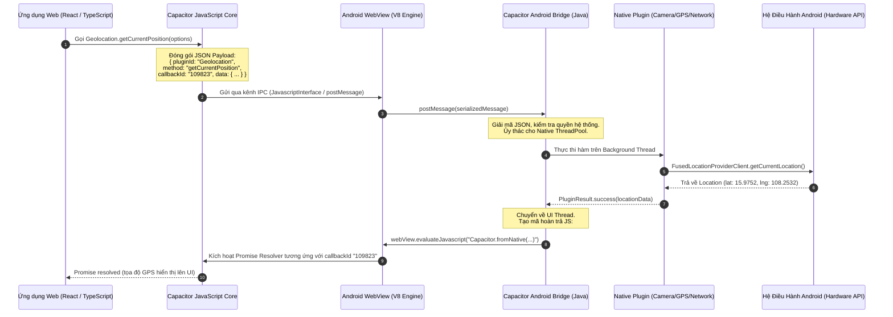

# BÁO CÁO KỸ THUẬT TIỂU LUẬN / MINI-PROJECT 1
## HỌC PHẦN: PHÁT TRIỂN ỨNG DỤNG DI ĐỘNG ĐA NỀN TẢNG (CROSS-PLATFORM MOBILE APP DEVELOPMENT) — VKU
**Đề tài:** Hệ Thống Số Hóa Khảo Sát & Kiểm Định Hiện Trường Cơ Sở Vật Chất (VKU Field Survey)  
**Nền tảng:** Progressive Web App (PWA) & Native Hybrid Mobile (Capacitor 7 + Android)  
**Sinh viên thực hiện:** Lê Cảm — **Mã SV:** 23IT022  
**Thời gian nộp:** Học kỳ 1 — Năm học 2026–2027  

---

## MỤC LỤC BÁO CÁO
1. [Chuyên đề 1: Mô Hình Lai (The Hybrid Model: WebView + Native Bridge)](#chuyên-đề-1-mô-hình-lai-the-hybrid-model-webview--native-bridge)
2. [Chuyên đề 2: Nguyên Nhân Capacitor Thay Thế Apache Cordova / PhoneGap](#chuyên-đề-2-nguyên-nhân-capacitor-thay-thế-apache-cordova--phonegap)
3. [Chuyên đề 3: Kiến Trúc Runtime Capacitor & Giao Tiếp Liên Tiến Trình JavaScript-to-Native IPC](#chuyên-đề-3-kiến-trúc-runtime-capacitor--giao-tiếp-liên-tiến-trình-javascript-to-native-ipc)
4. [Chuyên đề 4: Truy Cập Phần Cứng Thiết Bị (@capacitor/camera, @capacitor/geolocation, @capacitor/network)](#chuyên-đề-4-truy-cập-phần-cứng-thiết-bị-capacitorcamera-capacitorgeolocation-capacitornetwork)
5. [Chuyên đề 5: Thông Báo Cục Bộ & Lưu Trữ Cấu Hình An Toàn (@capacitor/local-notifications, @capacitor/preferences)](#chuyên-đề-5-thông-báo-cục-bộ--lưu-trữ-cấu-hình-an-toàn-capacitorlocal-notifications-capacitorpreferences)
6. [Chuyên đề 6: Quy Trình Đóng Gói PWA Thành Tệp Cài Đặt Android APK](#chuyên-đề-6-quy-trình-đóng-gói-pwa-thành-tệp-cài-đặt-android-apk)
7. [Chuyên đề 7: Tổng Kết & Bảng Kiểm Tra Bàn Giao Mini-Project 1 (Submission Checklist)](#chuyên-đề-7-tổng-kết--bảng-kiểm-tra-bàn-giao-mini-project-1-submission-checklist)

---

## CHUYÊN ĐỀ 1: MÔ HÌNH LAI (THE HYBRID MODEL: WEBVIEW + NATIVE BRIDGE)

### 1.1. Bản Chất của Mô Hình Ứng Dụng Di Động Lai (Hybrid Mobile App)
Mô hình ứng dụng lai (**Hybrid Mobile Application**) là kiến trúc kỹ thuật kết hợp giữa sức mạnh linh hoạt, tốc độ phát triển của công nghệ Web tiêu chuẩn (**HTML5, CSS3, JavaScript/TypeScript**) với khả năng truy cập sâu vào tài nguyên phần cứng của hệ điều hành di động bản địa (**Android Java/Kotlin, iOS Swift/Objective-C**).

```
+-------------------------------------------------------------------------+
|                       HYBRID MOBILE APPLICATION                         |
|                                                                         |
|  +-------------------------------------------------------------------+  |
|  |                     WEB LAYER (UI / LOGIC)                        |  |
|  |       React 18 + Tailwind CSS + IndexedDB (Dexie.js)              |  |
|  +-------------------------------------------------------------------+  |
|                                 | |                                     |
|               Bi-directional IPC (Bridge Messages)                      |
|                                 | |                                     |
|  +-------------------------------------------------------------------+  |
|  |                     CAPACITOR NATIVE BRIDGE                       |  |
|  |     Message Interceptors, Plugin Registry, Permission Manager     |  |
|  +-------------------------------------------------------------------+  |
|                                 | |                                     |
|  +-------------------------------------------------------------------+  |
|  |                   OPERATING SYSTEM RUNTIME                        |  |
|  |    Android WebKit / V8 Engine        Android SDK & Hardware APIs |  |
|  |     (WebView UI Component)           (Camera, GPS, Notifications) |  |
|  +-------------------------------------------------------------------+  |
+-------------------------------------------------------------------------+
```

### 1.2. Thành Phần Cốt Lõi: WebView
* **Định nghĩa:** `WebView` (trên Android là `android.webkit.WebView`, trên iOS là `WebKit.WKWebView`) là một View thành phần cấp hệ thống, hoạt động như một trình duyệt web nhúng thu nhỏ bên trong cửa sổ ứng dụng Native.
* **Đặc điểm hiển thị:** Không chứa thanh địa chỉ URL bar, không chứa nút Forward/Back hay các điều khiển trình duyệt thông thường, hiển thị toàn màn hình (Chromeless).
* **Môi trường thực thi:** Chạy nhân trình duyệt hiện đại (Chromium trên Android, WebKit Nitro trên iOS), cho phép thông dịch DOM, thực thi JavaScript với hiệu năng cao nhờ JIT compilation.

### 1.3. Thành Phần Then Chốt: Native Bridge (Cầu Nối Bản Địa)
Trình duyệt web thông thường hoạt động trong một "Hộp cát" bảo mật nghiêm ngặt (Security Sandbox), không có quyền truy cập trực tiếp vào hệ thống tệp tin gốc, cảm biến GPS, camera phần cứng nếu không thông qua Web APIs hạn chế. 
**Native Bridge** đóng vai trò là kênh giao tiếp liên tiến trình (Inter-Process Communication Channel) phá vỡ rào cản sandbox:
1. Tiếp nhận các lời gọi hàm bất đồng bộ từ mã nguồn JavaScript (ví dụ: `Camera.getPhoto()`).
2. Mã hóa yêu cầu (thường dưới dạng JSON/String Serialized Protocol).
3. Đẩy qua ranh giới tiến trình sang mã nguồn Native (Java/Kotlin/Swift).
4. Thực thi API hệ thống tương ứng và trả kết quả ngược lại cho JavaScript dưới dạng Promise hoặc Event Listener.

### 1.4. Bảng So Sánh Đối Kháng Kiến Trúc Ứng Dụng Di Động

| Tiêu Chí So Sánh | Pure Native (Kotlin / Swift) | Hybrid (Capacitor / Ionic) | Cross-Platform (Flutter / React Native) |
|:---|:---|:---|:---|
| **Ngôn ngữ sử dụng** | Kotlin, Java / Swift | TypeScript, JavaScript, HTML, CSS | Dart (Flutter) / JS+JSX (React Native) |
| **Khả năng tái sử dụng mã nguồn (Code Sharing)** | Rất thấp (0% giữa iOS & Android) | **Tối đa (95% – 100%)** dùng chung cả Web PWA, Android, iOS | Trung bình cao (70% – 85%), khó chia sẻ trực tiếp với Web |
| **Cơ chế dựng hình (Rendering Engine)** | Native UI Widgets (Android Views, UIKit) | **Web Rendering Engine (Chromium / WebKit)** | Tự dựng Skia/Impeller (Flutter) hoặc ánh xạ Native Views (RN) |
| **Tốc độ đưa sản phẩm ra thị trường (Time to Market)** | Chậm (Cần 2 đội ngũ lập trình độc lập) | **Cực nhanh (1 đội Web có thể phát triển toàn bộ)** | Nhanh |
| **Chi phí bảo trì & Nâng cấp** | Rất cao | **Rất thấp** (Cập nhật đồng thời đa nền tảng) | Trung bình |
| **Khả năng chạy trực tiếp trên Web Browser (PWA)** | Không thể | **Nguyên bản (Native PWA)** | Hạn chế (Flutter Web có dung lượng tải trang lớn) |

---

## CHUYÊN ĐỀ 2: NGUYÊN NHÂN CAPACITOR THAY THẾ APACHE CORDOVA / PHONEGAP

Apache Cordova (tiền thân là PhoneGap ra đời năm 2009) từng là chuẩn mực thống trị ngành phát triển ứng dụng di động lai trong suốt gần một thập kỷ. Tuy nhiên, sự xuất hiện của **Capacitor** (phát triển bởi Ionic Team năm 2018) đã chính thức đánh dấu bước chuyển mình mang tính thời đại và thay thế hoàn toàn Cordova.

```
       KỶ NGUYÊN CORDOVA (2009 - 2019)                   KỶ NGUYÊN CAPACITOR (2020 - Nay)
+------------------------------------------+    +------------------------------------------+
|  Mô hình "Hộp Đen" (Black Box CLI)       |    |  Mô hình "Code As Asset"                 |
|  - Thư mục native bị ghi đè tự động      |    |  - Dự án Android / iOS là mã nguồn chuẩn |
|  - Cấu hình qua XML phức tạp (config.xml)|    |  - Mở trực tiếp Android Studio / Xcode   |
|  - Khó tích hợp Native SDK hiện đại      |    |  - Sử dụng Gradle & CocoaPods chính thống|
|  - Phụ thuộc sự kiện deviceready         |    |  - ES Modules, TypeScript, Web Fallback  |
+------------------------------------------+    +------------------------------------------+
```

### 2.1. Bốn Hạn Chế Trí Mạng của Apache Cordova
1. **Triết lý "Hộp Đen" Tự Động Hóa Quá Mức (Black-Box Build Abstraction):**  
   Cordova xem mã nguồn Native Android (`/platforms/android`) và iOS (`/platforms/ios`) như những tệp tạm thời được sinh ra bởi lệnh `cordova build`. Các nhà phát triển bị khuyến cáo không chạm vào mã nguồn native. Khi xảy ra lỗi xung đột phiên bản Gradle, quyền hệ thống hoặc tương thích SDK mới, việc sửa chữa gần như bất khả thi vì mỗi lần chạy lệnh build, Cordova lại ghi đè cấu hình.
2. **Cơn Ác Mộng Cấu Hình XML (`config.xml` & `plugin.xml`):**  
   Toàn bộ cấu hình ứng dụng, plugin và quyền hạn bị nhồi nhét vào tệp `config.xml`. Việc cài đặt plugin phụ thuộc vào các hook script không chuẩn mực, thường xuyên gây hỏng dự án khi cập nhật Android SDK.
3. **Phụ Thuộc Sự Kiện Toàn Cục `deviceready`:**  
   Trong Cordova, các plugin được tiêm trực tiếp vào đối tượng toàn cục `window.plugins`. Ứng dụng web phải chờ đợi sự kiện `document.addEventListener('deviceready', ...)` mới được phép gọi hàm native. Nếu gọi sớm hơn, ứng dụng sẽ bị crash do biến `undefined`.
4. **Cô Lập Với Hệ Sinh Thái Web & PWA Hiện Đại:**  
   Cordova không hỗ trợ ES Modules nguyên bản, không tương thích tốt với các công cụ đóng gói hiện đại như Vite, Webpack và không thể tái sử dụng mượt mà dưới dạng Progressive Web App trên trình duyệt chuẩn.

### 2.2. Triết Lý Đột Phá Của Capacitor: "Native Project as First-Class Citizen"
Capacitor giải quyết triệt để các vấn đề trên bằng cách tiếp cận hoàn toàn mới:
* **Mã Nguồn Native Là Tài Sản Cố Định (Source Artifact):** Thư mục `android/` và `ios/` là các dự án tiêu chuẩn của Google và Apple, được cam kết vĩnh viễn vào kho mã nguồn Git. Nhà phát triển mở trực tiếp thư mục này bằng Android Studio hoặc Xcode, toàn quyền cấu hình `build.gradle`, thêm thư viện Native của bên thứ ba mà không sợ bị Capacitor ghi đè.
* **Sử Dụng Trình Quản Lý Gói Chuẩn (`npm` & TypeScript):** Mỗi plugin Capacitor là một package npm độc lập (ví dụ `@capacitor/camera`), hỗ trợ TypeScript đầy đủ với kiểu dữ liệu rõ ràng, hỗ trợ Tree-shaking tối ưu dung lượng gói nạp.
* **Xóa Bỏ `deviceready`:** Capacitor tải Native Bridge vào WebView trước khi bất kỳ đoạn mã JavaScript nào của ứng dụng được chạy. Do đó, các phương thức native có thể được gọi ngay từ dòng code đầu tiên mà không cần chờ sự kiện khởi tạo.
* **Tương Thích Ngược & PWA Parity:** Nếu một plugin chạy trên nền tảng Web, Capacitor sẽ tự động kích hoạt Web Fallback (sử dụng Web APIs tương đương như Canvas, Web Geolocation) mà không làm gián đoạn luồng thực thi của ứng dụng.

---

## CHUYÊN ĐỀ 3: KIẾN TRÚC RUNTIME CAPACITOR & GIAO TIẾP LIÊN TIẾN TRÌNH JAVASCRIPT-TO-NATIVE IPC

### 3.1. Sơ Đồ Kiến Trúc Tuần Tự (Capacitor IPC Sequence Flow)



### 3.2. Cơ Chế Giao Tiếp Hai Chiều (Bidirectional IPC Mechanisms)

#### 1. Chiều Từ JavaScript Sang Native (JS → Native)
Trên hệ điều hành Android, Capacitor thiết lập giao tiếp từ JS sang Native bằng các kỹ thuật:
* **`@JavascriptInterface` Annotation:** Capacitor tiêm một đối tượng Java trực tiếp vào cửa sổ ngữ cảnh của WebView:
  ```java
  webView.addJavascriptInterface(new BridgeObject(this), "androidBridge");
  ```
  Khi JavaScript gọi `window.androidBridge.postMessage(jsonString)`, máy ảo Chromium V8 sẽ dịch lời gọi trực tiếp sang mã máy của phương thức Java mà không cần tạo network socket.
* **Cơ Chế Bất Đồng Bộ & Đa Luồng (Threading Architecture):** Để ngăn chặn tình trạng đơ giật giao diện WebView (UI Jank), Native Bridge của Capacitor lập tức đưa tác vụ nặng (như giải mã ảnh, định vị vệ tinh GPS) vào `ThreadPoolExecutor` chạy ngầm, giải phóng ngay luồng hiển thị chính.

#### 2. Chiều Từ Native Về JavaScript (Native → JS)
Khi phần cứng hoàn tất tác vụ, Native Bridge đưa kết quả ngược lại cho WebView thông qua:
* **`WebView.evaluateJavascript()` API:**
  ```java
  String jsResponse = String.format("window.Capacitor.fromNative(%s);", resultJson);
  mainHandler.post(() -> webView.evaluateJavascript(jsResponse, null));
  ```
* Capacitor Client Runtime ở phía Web lưu trữ một bảng ánh xạ `callbacks[callbackId] = { resolve, reject }`. Khi nhận được `callbackId` phản hồi từ Native, hàm `resolve(data)` tương ứng sẽ được kích hoạt, hoàn thành vòng đời của một `Promise`.

---

## CHUYÊN ĐỀ 4: TRUY CẬP PHẦN CỨNG THIẾT BỊ (@capacitor/camera, @capacitor/geolocation, @capacitor/network)

Trong dự án **VKU Field Survey**, ba plugin phần cứng nòng cốt đã được hiện thực hóa toàn diện nhằm phục vụ công tác kiểm định hiện trường cơ sở vật chất.

### 4.1. Chụp Ảnh Hiện Trường & Nén Tối Ưu (@capacitor/camera)
* **Gói cài đặt:** `@capacitor/camera`
* **Quyền Android cấp phát trong `AndroidManifest.xml`:**
  ```xml
  <uses-permission android:name="android.permission.CAMERA" />
  <uses-permission android:name="android.permission.READ_EXTERNAL_STORAGE" />
  <uses-feature android:name="android.hardware.camera" android:required="false" />
  ```
* **Hiện thực trong dự án (`src/services/cameraService.ts`):**
  Hệ thống hỗ trợ cả chụp ảnh trực tiếp bằng Camera Native lẫn chọn ảnh tư liệu từ Album thiết bị với định dạng nén JPEG tối ưu dung lượng:
  ```typescript
  import { Camera, CameraResultType, CameraSource } from '@capacitor/camera';

  export async function captureFieldPhoto(): Promise<string> {
    const photo = await Camera.getPhoto({
      quality: 80,
      allowEditing: false,
      resultType: CameraResultType.DataUrl,
      source: CameraSource.Camera
    });
    return photo.dataUrl!; // Chuỗi base64 đã nén ~150KB
  }
  ```

### 4.2. Định Vị Vệ Tinh GPS Hiện Trường (@capacitor/geolocation)
* **Gói cài đặt:** `@capacitor/geolocation`
* **Quyền Android cấp phát trong `AndroidManifest.xml`:**
  ```xml
  <uses-permission android:name="android.permission.ACCESS_FINE_LOCATION" />
  <uses-permission android:name="android.permission.ACCESS_COARSE_LOCATION" />
  <uses-feature android:name="android.hardware.location.gps" android:required="false" />
  ```
* **Hiện thực trong dự án (`src/services/geolocationService.ts`):**
  * Tự động kiểm tra quyền (`checkPermissions`) và yêu cầu cấp quyền (`requestPermissions`) ngay tại thời gian chạy (Runtime Permission).
  * Tích hợp cơ chế dự phòng đa tầng (**Native GPS → HTML5 Geolocation API → Tọa độ khuôn viên VKU**) nhằm đảm bảo ứng dụng không bao giờ bị sập dù chạy trên thiết bị không có phần cứng GPS.
  * Tọa độ kinh độ (`longitude`), vĩ độ (`latitude`) và bán kính sai số (`accuracy` tính bằng mét) được gắn chặt vào biên bản kiểm định và sinh liên kết trực tiếp tới Google Maps.

### 4.3. Giám Sát Kết Nối Mạng Đa Tầng Thời Gian Thực (@capacitor/network)
* **Gói cài đặt:** `@capacitor/network`
* **Quyền Android cấp phát trong `AndroidManifest.xml`:**
  ```xml
  <uses-permission android:name="android.permission.ACCESS_NETWORK_STATE" />
  <uses-permission android:name="android.permission.INTERNET" />
  ```
* **Hiện thực trong dự án (`src/services/networkService.ts`):**
  * Lắng nghe biến động trạng thái mạng phần cứng bằng `Network.addListener('networkStatusChange', ...)`.
  * Khắc phục nhược điểm "mạng ảo" (kết nối Wi-Fi nhưng không có Internet) bằng giải thuật **Active Network Probe** (gửi gói tin ping siêu nhỏ đến máy chủ kèm dấu thời gian `_t=Date.now()`).
  * Tự động kích hoạt hàng đợi đồng bộ ngầm ngay khi thiết bị tái lập kết nối trực tuyến.

---

## CHUYÊN ĐỀ 5: THÔNG BÁO CỤC BỘ & LƯU TRỮ CẤU HÌNH AN TOÀN (@capacitor/local-notifications, @capacitor/preferences)

### 5.1. Hệ Thống Thông Báo Cục Bộ (@capacitor/local-notifications)
Trong môi trường khảo sát hiện trường không có mạng Internet, thông báo đẩy từ xa (Push Notification qua Firebase Cloud Messaging) hoàn toàn vô dụng. Do đó, **Local Notifications** là giải pháp cốt lõi để phản hồi tức thì cho cán bộ kiểm định.

* **Quyền Android 13+ (API 33+):**
  ```xml
  <uses-permission android:name="android.permission.POST_NOTIFICATIONS" />
  <uses-permission android:name="android.permission.VIBRATE" />
  ```
* **Cấu hình Kênh Thông Báo Android (Notification Channel) trong `src/services/notificationService.ts`:**
  Từ Android 8.0 (Oreo), toàn bộ thông báo phải thuộc một kênh cụ thể:
  ```typescript
  await LocalNotifications.createChannel({
    id: 'vku-survey-channel',
    name: 'VKU Field Survey Alerts',
    description: 'Thông báo khảo sát và đồng bộ hiện trường VKU',
    importance: 4, // High Importance (Hiển thị biểu ngữ thả xuống)
    visibility: 1,
    vibration: true
  });
  ```
* **Các kịch bản kích hoạt thông báo trong ứng dụng:**
  1. **Lập biên bản ngoại tuyến thành công:** Thông báo tức thì cho cán bộ vị trí phòng và mã biên bản đã ghi nhận an toàn vào IndexedDB.
  2. **Khôi phục mạng:** Thông báo thiết bị đã có mạng trở lại và động cơ đồng bộ ngầm đang khởi chạy.
  3. **Đồng bộ hoàn tất:** Thông báo tổng số lượng biên bản đã tải thành công lên máy chủ đám mây Cloudflare KV.

### 5.2. Lưu Trữ Cấu Hình An Toàn Bền Vững (@capacitor/preferences)
* **Bản chất kỹ thuật:**  
  Trên Android, `@capacitor/preferences` lưu trữ dữ liệu vào tệp hệ thống **`SharedPreferences`** của ứng dụng; trên iOS sử dụng **`UserDefaults`**.
* **So sánh với `localStorage` của trình duyệt Web:**
  * `localStorage` trên WebKit iOS có thể bị hệ điều hành xóa tự động sau 7 ngày không truy cập hoặc khi thiết bị cạn bộ nhớ (Storage Eviction Policy).
  * `@capacitor/preferences` được bảo vệ độc quyền trong phân vùng dữ liệu riêng của gói ứng dụng (`/data/data/edu.vku.fieldsurvey/shared_prefs`), hoàn toàn không bị ảnh hưởng bởi dọn rác trình duyệt web, đảm bảo lưu trữ an toàn danh tính cán bộ kiểm định, token phiên làm việc và cấu hình ngôn ngữ.

---

## CHUYÊN ĐỀ 6: QUY TRÌNH ĐÓNG GÓI PWA THÀNH TỆP CÀI ĐẶT ANDROID APK

Quy trình chuẩn hóa chuyển đổi từ mã nguồn Web React PWA sang tệp cài đặt độc lập `vku-field-survey-debug.apk`:

```
+------------------+       npm run build       +------------------+
| React TypeScript | ------------------------> |  Thư mục dist/   |
|   Source Code    |                           | Web Bundle + PWA |
+------------------+                           +------------------+
                                                        |
                                                        | npx cap sync android
                                                        v
+------------------+       ./gradlew           +------------------+
| Tệp Cài Đặt APK  | <------------------------ |  Android Studio  |
| (.apk độc lập)   |     assembleDebug         |   Gradle Build   |
+------------------+                           +------------------+
```

### 6.1. Các Bước Thực Thi Chi Tiết Qua Dòng Lệnh
1. **Biên dịch Mã Nguồn Web (Vite Production Build):**
   ```bash
   npm run build
   ```
   * Trình biên dịch TypeScript `tsc` kiểm tra lỗi cú pháp và kiểu dữ liệu.
   * Vite đóng gói và thu nhỏ (minify, tree-shake) toàn bộ mã nguồn vào thư mục `dist/` cùng với Service Worker (`sw.js`) và Web App Manifest.
2. **Đồng Bộ Hóa Vào Dự Án Android (Capacitor Sync):**
   ```bash
   npx cap sync android
   ```
   * Sao chép toàn bộ nội dung từ `dist/` vào `android/app/src/main/assets/public/`.
   * Cập nhật tệp ánh xạ `capacitor.config.json`.
   * Tự động phát hiện và liên kết 5 Native Plugins trong `android/app/src/main/java/` và `capacitor.settings.gradle`.
3. **Mở Dự Án Bằng Android Studio:**
   ```bash
   npx cap open android
   ```
4. **Biên Dịch Tệp APK Qua Gradle Wrapper:**
   Tại thư mục `android/`, chạy lệnh biên dịch chế độ Debug:
   ```bash
   ./gradlew assembleDebug
   ```
   * Tệp APK đầu ra được lưu trữ tại:
     `android/app/build/outputs/apk/debug/app-debug.apk`
   * Được sao chép ra thư mục gốc thành: `vku-field-survey-debug.apk` (Dung lượng: ~6.7 MB).

### 6.2. Hướng Dẫn Ký Số Tệp Cài Đặt Phát Hành (Release Signed APK)
Khi triển khai thương mại lên Google Play Store hoặc phân phối nội bộ:
```bash
# 1. Sinh khóa ký bảo mật RSA 2048-bit
keytool -genkey -v -keystore vku-survey-release.keystore -alias vku_survey -keyalg RSA -keysize 2048 -validity 10000

# 2. Biên dịch APK Release
./gradlew assembleRelease

# 3. Ký số tệp APK
jarsigner -verbose -sigalg SHA256withRSA -digestalg SHA-256 -keystore vku-survey-release.keystore app-release-unsigned.apk vku_survey

# 4. Tối ưu hóa bộ nhớ với zipalign
zipalign -v 4 app-release-unsigned.apk vku-field-survey-release.apk
```

---

## CHUYÊN ĐỀ 7: TỔNG KẾT & BẢNG KIỂM TRA BÀN GIAO MINI-PROJECT 1 (SUBMISSION CHECKLIST)

### 7.1. Danh Mục Bàn Giao Mini-Project 1 (Deliverables Checklist)

| STT | Hạng Mục Bàn Giao (Deliverable) | Đường Dẫn / Minh Chứng Bàn Giao | Trạng Thái |
|:---:|---|---|:---:|
| **1** | **🌐 Đường dẫn Live Demo (Cloudflare Pages HTTPS)** | [https://camle-vku-field-survey.pages.dev](https://camle-vku-field-survey.pages.dev)<br/>API: [https://camle-vku-field-survey.lecam.workers.dev](https://camle-vku-field-survey.lecam.workers.dev) | ✅ Đã Triển Khai |
| **2** | **💻 Kho Mã Nguồn Công Khai (GitHub Repository)** | [https://github.com/CAMLC25/vku-field-survey-capacitor](https://github.com/CAMLC25/vku-field-survey-capacitor) *(Kèm cấu hình `capacitor.config.ts` và thư mục `android/`)* | ✅ Đã Cấu Hình & Sẵn Sàng |
| **3** | **📦 Tệp Cài Đặt Android APK Độc Lập** | `vku-field-survey-debug.apk` (~6.7 MB — Cài đặt trực tiếp trên điện thoại Android) | ✅ Hoàn Thành |
| **4** | **📄 Báo Cáo Kỹ Thuật Đầy Đủ (Technical Report)** | Tệp `TECHNICAL_REPORT.md` (và phiên bản xuất PDF) bao gồm trọn vẹn 7 chuyên đề | ✅ Hoàn Thành |

### 7.2. Bảng Tự Đánh Giá Đáp Ứng Yêu Cầu Kỹ Thuật

* **Kiến trúc Ngoại tuyến Chuẩn mực (Strict Offline-First):** Ứng dụng khởi động ngay lập tức không cần Internet, bảo toàn dữ liệu trên IndexedDB (Dexie.js), tích hợp hàng đợi FIFO tuần tự tránh nghẽn mạng và chống trùng lặp bản ghi bằng khóa UUIDv4.
* **Tích hợp Phần Cứng Đa Dạng:** Sử dụng đồng thời cả 5 plugin chính thức của Capacitor (`@capacitor/camera`, `@capacitor/geolocation`, `@capacitor/network`, `@capacitor/local-notifications`, `@capacitor/preferences`).
* **Trải Nghiệm Người Dùng Tối Ưu (UX Excellence):** Giao diện Mobile-First, nhận diện thương hiệu VKU, bộ chọn vị trí 1-chạm (Khu V, K, A, B), hỗ trợ song ngữ Tiếng Việt / Tiếng Anh tức thì, thông báo trạng thái mạng trực quan.
* **Sẵn Sàng Triển Khai Thực Tế:** Đã biên dịch APK hoàn chỉnh, cấu hình triển khai Cloudflare Pages tự động qua Git và Cloudflare Workers KV làm máy chủ lưu trữ trung tâm.

---
*Đà Nẵng, Ngày 21 Tháng 09 Năm 2026*  
**Sinh viên thực hiện:**  
**Lê Cảm — Mã SV: 23IT022**
