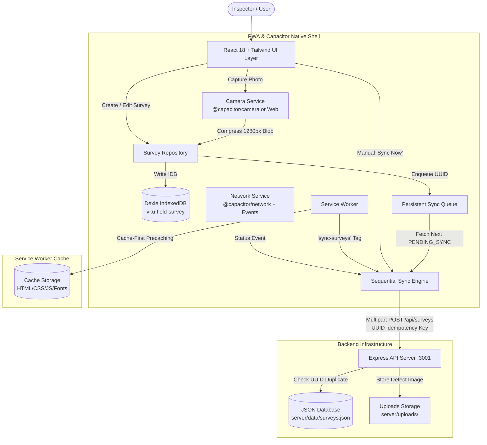

# VKU Field Survey — System Architecture

## 1. Problem Statement
Field inspections across the Vietnam-Korea University of Information and Communication Technology (VKU) campus frequently take place in basements, server vaults, electrical rooms, and newly constructed wings where Wi-Fi and cellular reception (4G/5G) are completely unavailable or intermittent. Conventional client-server mobile apps fail under these conditions, losing uncommitted inspector reports or hanging during upload requests.

## 2. Architectural Solution
The VKU Field Survey application implements an **Offline-First Architecture**. In this paradigm:
- **IndexedDB is the primary source of truth** for all local inspection writes.
- Network operations are asynchronous background synchronization tasks, never blocking UI interactions.
- Assets are cached using a **Cache-First Service Worker**, ensuring the application shell launches instantly even with network interfaces disabled.
- The same codebase runs as an installable Progressive Web App (PWA) in the browser and as a native Android APK via **Capacitor**.

---

## 3. Layered Design & Separation of Concerns

| Layer | Technologies | Responsibilities |
| :--- | :--- | :--- |
| **Presentation / UI** | React 18, Tailwind CSS, Lucide Icons | Responsive mobile-first forms, condition rating stars, offline/online status badges, history filters, diagnostic drawer. |
| **Persistence (Local)** | Dexie.js (IndexedDB wrapper) | Stores surveys table and syncQueue table. Guarantees ACID-like transaction safety locally. |
| **App Shell Caching** | Workbox, VitePWA, Service Worker | Cache-First strategy for static assets (HTML, CSS, JS, fonts, icons). Handles offline boot. |
| **Sync Engine** | Sequential Queue, Mutex Lock, Background Sync API | Orchestrates one-by-one upload, error recovery, attempt counting, and status transitions (`PENDING_SYNC` -> `SYNCING` -> `SYNCED` / `FAILED`). |
| **Hardware Abstraction**| Capacitor Core, Camera, Network | Unifies native Android camera and network monitoring with standard browser fallbacks. |
| **Server / API** | Node.js, Express, Multer | Validates payloads, enforces idempotency using client UUIDs, persists photos and survey metadata. |

---

## 4. Key Architectural Highlights
1. **Idempotency**: Every inspection has a client-generated UUIDv4. If network drops mid-request and the client retries, the server identifies the UUID and returns the existing record without duplication.
2. **Sequential Queue**: Rather than blasting concurrent requests that overwhelm unreliable field networks, the sync engine processes records strictly sequentially (`for (const item of queue)`).
3. **Data Protection Guarantee**: A failed sync marks a survey as `FAILED` with a recorded `lastSyncError`, preserving all field notes and local photos for subsequent automated or manual retry.
