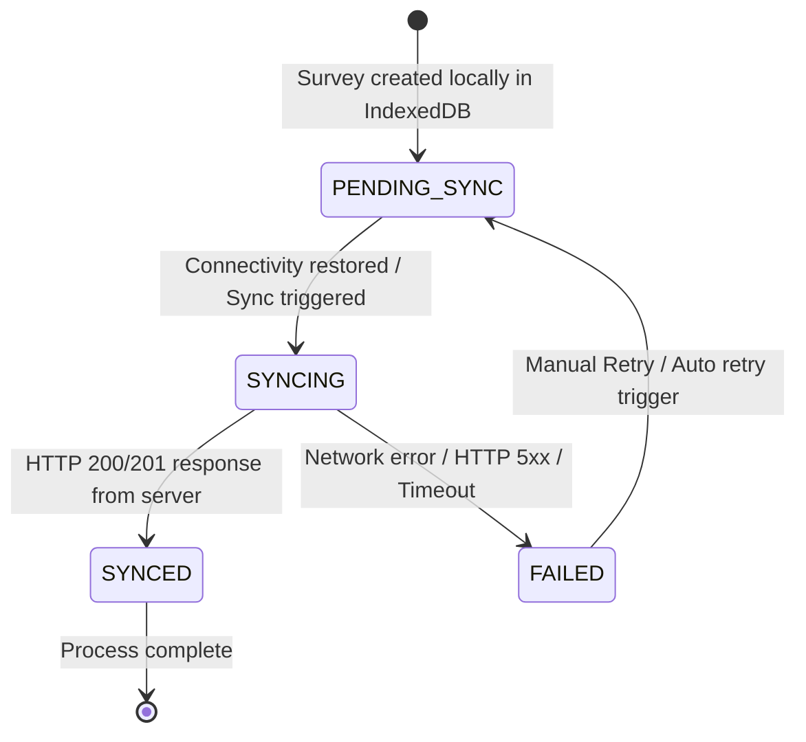
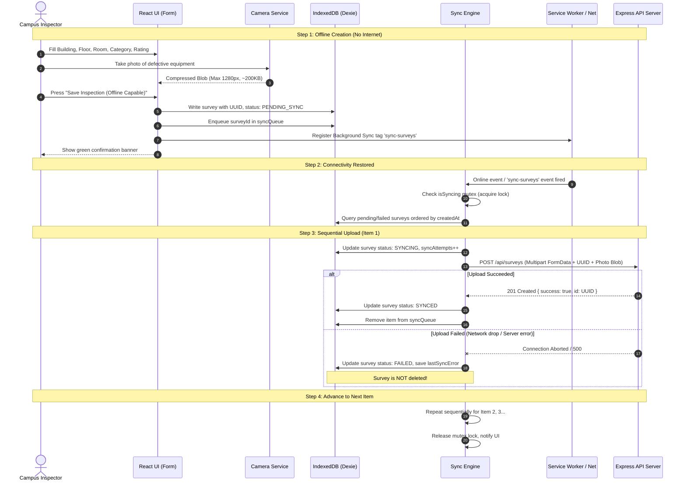

# Offline Lifecycle & Synchronization Flow

## 1. Survey State Machine

Every survey follows a deterministic state machine:

---

## 2. Step-by-Step Flow: Offline Capture to Cloud Persistence

---

## 3. Synchronization Triggers & Reliability Hierarchy

To guarantee reliability across all operating environments and browsers, VKU Field Survey uses a multi-layered trigger hierarchy:

1. **Background Sync API (`sync-surveys`)**:
   - Registered when saving a survey.
   - When supported (Chrome, Edge, Android Webview), the operating system wakes up the Service Worker even if the user has navigated away or closed the tab.
2. **Capacitor Network Plugin Listener (`networkStatusChange`)**:
   - Native event fired by Android OS when cellular or Wi-Fi connectivity changes from disconnected to connected.
3. **Browser Window `online` Event**:
   - Web standard listener detecting `window.addEventListener('online', ...)`.
4. **Reactive App Startup Hook**:
   - Checks for pending items upon app launch if online.
5. **Manual "Sync Now" & Per-Item "Retry" Buttons**:
   - Provides user agency during live inspections or lab demonstrations.
